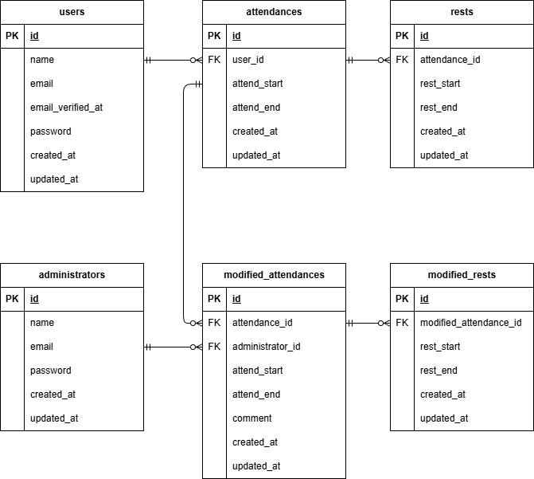

# 勤怠管理アプリ

## 環境構築

### Dockerビルド
- git clone
- docker-compose up -d --build

### Laravel環境構築
- docker-compose exec php bash
- composer install
- cp .env.example .env
- .envに以下の環境変数を追加
```
DB_CONNECTION=mysql
DB_HOST=mysql
DB_PORT=3306
DB_DATABASE=laravel_db
DB_USERNAME=laravel_user
DB_PASSWORD=laravel_pass
```
- php artisan key:generate
- php artisan migrate
- php artisan db:seed

## 使用技術（実行環境）
- PHP 8.1
- Laravel 8.83.8
- MySQL 8.0.26
- nginx 1.21.1

## ER図


## ダミーデータについて
### スタッフ
各スタッフでのログイン後にメール認証が必要となり、認証画面に従い、「認証メールを再送する」→「認証はこちらから」を押下し、MailHogサイトでの受信メールよりメール認証を行う。

- スタッフ1
    - 名前：山田 壱郎
    - メールアドレス：user01@example.com
    - パスワード：123456789

- スタッフ2
    - 名前：高橋 次郎
    - メールアドレス：user02@example.com
    - パスワード：123456789

- スタッフ3
    - 名前：渡辺 三津子
    - メールアドレス：user03@example.com
    - パスワード：123456789

### 管理者
- 管理者1
    - 名前：佐藤 大輔
    - メールアドレス：admin01@example.com
    - パスワード：password

- 管理者2
    - 名前：鈴木 花子
    - メールアドレス：admin02@example.com
    - パスワード：password
### 勤怠記録
2026年2月、3月分の土日を除く勤怠データを、各スタッフ分で作成済み。

## PHPUnitを利用したテストに関して
### テストファイル
tests/Feature/以下
- ユーザー登録（スタッフ・管理者）：RegisterTest.php
- ログイン（スタッフ・管理者）：LoginTest.php
- その他の各操作テスト：AttendanceTest.php

### 以下のコマンドを実行
```
//テスト用データベースの作成
docker-compose exec mysql bash
mysql -u root -p
//パスワードはrootと入力
create database demo_test;

docker-compose exec php bash
php artisan migrate:fresh --env=testing
php artisan test //各テストファイルを指定
```

## URL
- 開発環境: http://localhost/
- phpMyAdmin: http://localhost:8080/
- MailHog: http://localhost:8025/